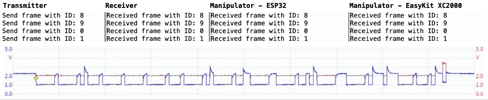

# CAN Frame Manipulation

## Overview
This respository contains two implementations of a passive CAN controller for receiving and manipulating CAN frames using a microcontroller. This CAN controller allows the manipulation of on-going CAN traffic and thus testing the safety and robustness of controller area networks against malicious nodes.

The basic functionality of the CAN controller is divided into a detection task, which receives and processes the current CAN frame in real time using a time-based approach, and an injection task, which manipulates the CRC checksum of the frame in the case of a CAN frame with the defined target ID and thus invalidates the frame.

The implementations were developed and tested for a baud rate of 250kbit/s for the [ESP32 microcontroller](https://www.espressif.com/en/products/socs/esp32) (dual-core) and the development kit [EasyKit XC2000](https://www.infineon.com/dgdl/Infineon--UM-v01_00-NA.pdf?fileId=db3a304316f66ee801175f31325a76d3) (single-core). Since the CAN controller only poses basic requirements on the host system, such as a connection to the CAN bus via GPIOs and a timer, it can be used on various hardware platforms and is freely extendable.

## ESP32
Based on the [ESP32 microcontroller](https://www.espressif.com/en/products/socs/esp32), the CAN controller provides a simple, low-cost jamming device that can be freely extended and easily integrated into existing networks.

To set up a controller area network with standard CAN nodes based on ESP32 microcontrollers, the [CAN driver from Thomas Barth](https://github.com/ThomasBarth/ESP32-CAN-Driver) is a good choice.

## EasyKit XC2000
The implementation of the CAN controller for microcontrollers of the [XC2000 series](https://en.wikipedia.org/wiki/XC_2000_family) extends the possible host platforms by reducing the required cores to one. Furthermore, the [EasyKit XC2000](https://www.infineon.com/dgdl/Infineon--UM-v01_00-NA.pdf?fileId=db3a304316f66ee801175f31325a76d3) board resembles real CAN nodes in the automotive sector such as the widely used gateway module J533. This implementation can therefore be used to investigate the reprogrammability and the resulting threats caused by infected CAN nodes in the car.
